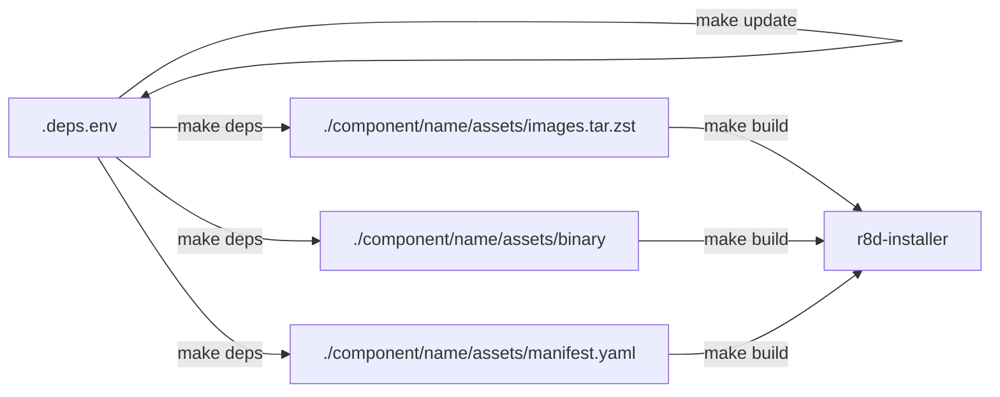

# Architecture

## Repo Structure
- cmd
    - r8d-installer: installer command
    - r8d-deps: builds the assets for everything and detects changes
- pkg
    - cli
        - host-preflight - pull in library and also has assets
    - component: defines the build and manage interface
        - rke2
        - kots
        - openebs
        - troubleshoot
    - utils
        - systemd maagement
        - install images
        - install addon/manifests
        - save container bundle
- .deps.env - manifest as input for generating 

## Developer Workflows

* `make update` <--> runs `./r8d-deps update`
    * runs nightly
* `make deps` <--> runs `./r8d-deps build`
* make clean: remove the deps

## Component Interfaces

### Build Interface
1. GetManifest()
1. GetImages()
1. GetBinaries()

## Management Interface
1. IsInstalled()
1. LoadManifests()
1. LoadImages()
1. LoadBinaries()
1. Remove()
1. Install()

# Design Thoughts

## Questions to Answer
1. Does RKE2 automatically sync the manifests directory without restart? YES
1. Can you use the RKE2 image directory for non-rke2 images? YES, it appears on restart only

### Unanswered
1. Will removing/modifying a file in the manifests directory cause RKE2 to update (useful for updates)? ?

## Do we need an interface for addons?
- No, because we should never need to add new ones.

## What kind of assets?
- executables on the path
- tarball (airgap images for rke2 itself)
- docker images
- manifests (local path provisioner)

## What's the best way to pull in the assets required? Can this be abstracted?
-> No, every repo has a different struct that keeps these from being loaded.
- Go CLI?
- Github Actions?
- Script?
- Makefile?

## Do we store dependencies in the repo?
No, this is probably a bad idea, but the build command needs to generate these to include in the overall binary.

## How should an installation look?

`r8d install server`

Any customizations go directorly into the RKE yaml as would be an ordinary installation.

## What is the ideal workflow for updates?

1. New version of an upstream component detected
1. Manifest are updated
1. Pull Request is made wth change
1. PR merged
1. New build with airgap artifacts released.
